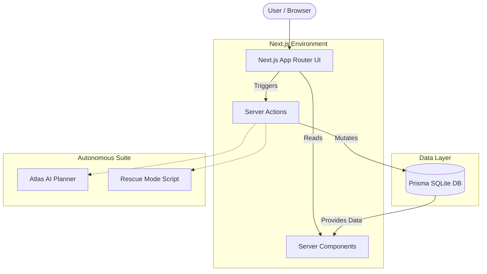

<div align="center">
  
  <h1>Chronix OS</h1>
  <p><strong>Execution without chaos.</strong></p>
  <p>An autonomous productivity orchestration platform that helps users avoid missed deadlines using a collaborative AI neural suite.</p>

  [](https://nextjs.org/)
  [](https://prisma.io/)
  [](https://www.typescriptlang.org/)
  [](https://tailwindcss.com/)
</div>

<hr />

## 🌟 The Vision

Chronix isn't just a task manager—it's an operating system for your ambition. By utilizing a suite of specialized digital agents, Chronix dynamically orchestrates your schedule, protects your deep work, and auto-corrects your trajectory when deadlines are at risk.

---

## 🤖 The Neural Suite (Active Agents)

Chronix employs a network of specific agents, each dedicated to a unique vector of your productivity.

| Agent | Status | Directive | Functionality |
| :--- | :---: | :--- | :--- |
| **Atlas (A-01)** | 🟢 **LIVE** | Strategic Core | Automatically breaks down high-level goals into actionable, prioritized sub-tasks and syncs them to your database. |
| **Rescue (A-05)** | 🟢 **LIVE** | Recovery & Triage | Activated during emergencies (Rescue Mode) to automatically defer non-essential tasks 7 days into the future, protecting your critical path. |
| **Orbit (A-02)** | 🟡 *Standby* | Automation | Monitors daily cross-platform syncs and filters incoming communications during Focus Blocks. |
| **Sentinel (A-03)**| 🟡 *Standby* | Risk Monitor | Scans your upcoming calendar for bottleneck risks and missing dependencies. |
| **Pulse (A-04)** | 🟡 *Standby* | Analytics | Tracks user engagement and calculates the Momentum Score baseline. |
| **Echo (A-06)** | 🟡 *Standby* | Synthesis | Drafts end-of-week stakeholder updates based on completed tasks. |

> **Note:** Atlas and Rescue are fully wired end-to-end with the Prisma backend! The others are currently tracking telemetry but awaiting their dedicated interactive action triggers.

---

## 🏗️ Architecture

Chronix operates on a bleeding-edge Client-Server Hybrid architecture built entirely within Next.js. 



---

## 🚀 Quick Start Guide

Ready to initialize the system? Follow these steps to get Chronix running locally.

### 1. Install Dependencies
Navigate into the frontend directory and install the Node modules.
```bash
cd frontend
npm install
```

### 2. Database Initialization
Chronix uses a local SQLite database for zero-config persistence. Generate the Prisma client and push the schema:
```bash
npx prisma generate
npx prisma db push
```

### 3. Boot the Matrix
Start the Turbopack-powered development server.
```bash
npm run dev
```
Open **[http://localhost:3000](http://localhost:3000)** in your browser.

---

## 🎯 Interactive Features

- [x] **Universal Auth:** Login via Firebase or instantly drop into the environment as a Demo User.
- [x] **Momentum Tracking:** Complete tasks to instantly watch your Momentum Score increase in real-time.
- [x] **Generative Planning:** Visit the `Goals` tab, type a massive ambition, and let Atlas generate your roadmap.
- [x] **Panic Button:** Overwhelmed? Hit **Rescue Mode** in the Rescue Center to instantly clear your schedule of low-priority noise.
- [x] **Future Projection:** The `Future Self` tab dynamically calculates your probability of long-term success based on your live completion metrics.

<div align="center">
  <p>Built with ❤️ during the Vibe2Ship Hackathon.</p>
</div>
